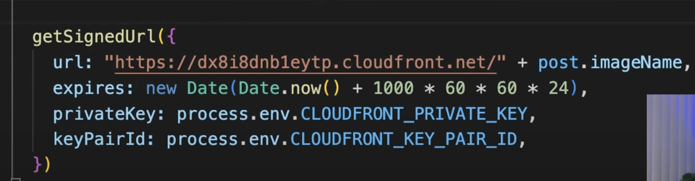
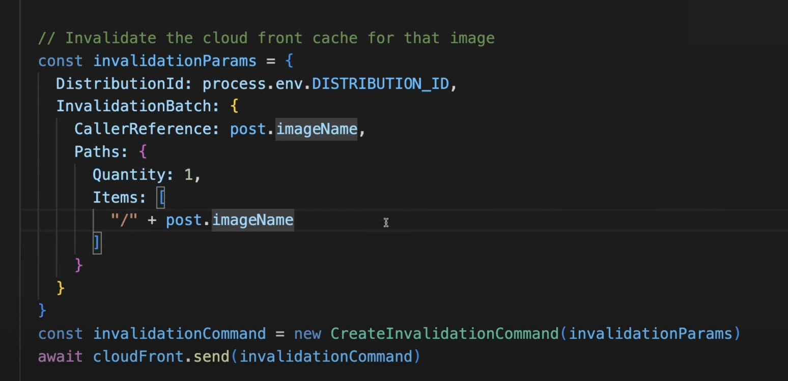

Make use of S3 to store the static content and place CDN before S3 for increase in the performance
CDN is a distributed network os servers that caches the data close to end users - AWS Edge Locations per regions

Create ClouDFront CDN - with source as S3 ARN.
Once created, we need to update th policy on S3 as CDN will provide. 

To access
https://d21wex5xiws5fpzzzz.cloudfront.net/S3ObjecteyName

Distribution%20domain%20name/S3KeyName
If we delete S3 key the CDN will still hold the key for a day

Is someone is having access to this url, they can access=> Security Concern
Solution - to sign the urls and add expiriy time to them

https://www.youtube.com/watch?v=EIYrhbBk7do&list=PL0X6fGhFFNTeGDRuMlQBO1fs4vvQA48tM&index=3

1. Create a private key openssl on system
2. Generate a public key from the private key and store in CDN boundaries
3. This will allow only signed url access from CDN
4. Need to use AWS CLoudFrountSigner Library from NPM - getSignedUrl

import { getSignedUrl } from "@aws-sdk/cloudfront-signer"; // ESM
// const { getSignedUrl } = require("@aws-sdk/cloudfront-signer"); // CJS

const cloudfrontDistributionDomain = "https://d111111abcdef8.cloudfront.net";
const s3ObjectKey = "private-content/private.jpeg";
const url = `${cloudfrontDistributionDomain}/${s3ObjectKey}`;
const privateKey = "CONTENTS-OF-PRIVATE-KEY";
const keyPairId = "PUBLIC-KEY-ID-OF-CLOUDFRONT-KEY-PAIR";
const dateLessThan = "2022-01-01"; // any Date constructor compatible

const signedUrl = getSignedUrl({
  url,
  keyPairId,
  dateLessThan,
  privateKey,
});
https://www.npmjs.com/package/@aws-sdk/cloudfront-signer

We should invalidate from the CDN manually
So for this we need cloudfront lib from npm
