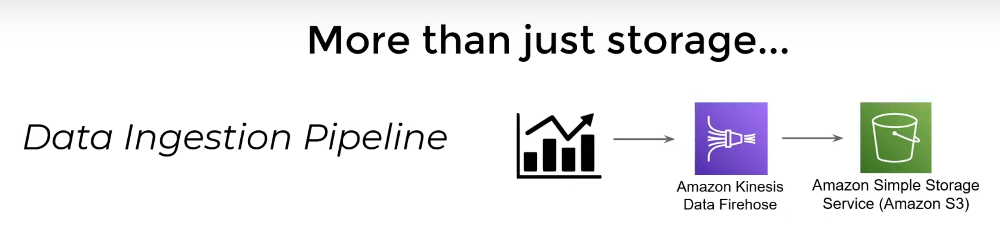
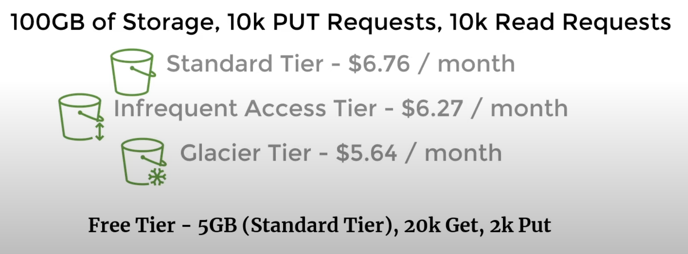

1. We can store any type of content upto 5TB easily
2. Highly scalable, available, durable and easy to integrate
3. Buckets name should be globally unique and are case insenstivte.
4. Same as a file directory
5. Objects are contents
6. S3 Storage Classes - allow you to reduce cost at some expenses like availability and latencies
    a. Standard (default)
    b. Intellignet
    c. Glacier etc..
7. We can use a dynamic model to move our data over time for instance at start we can use Standard -> If data is 6 month old we can most to Infreq access type -> Glacier.
8. Bucket lifecycle rules automate data movement process for step 7.
 - Stock Market Data gets pushed to Kenesis and if the data size >= 5GB, we will push to S3
9. Prices depended on Storage Class as well as Sotrage, Get, Put Object and transfer data.

createBucket
deleteBucket
putObject
getObject
deleteObject
copyObject(src, dest)

Differnt Overloaded verions

Also we have options to maintain versions of a file while setting a bucket

We can control the bucket config using SDK methods